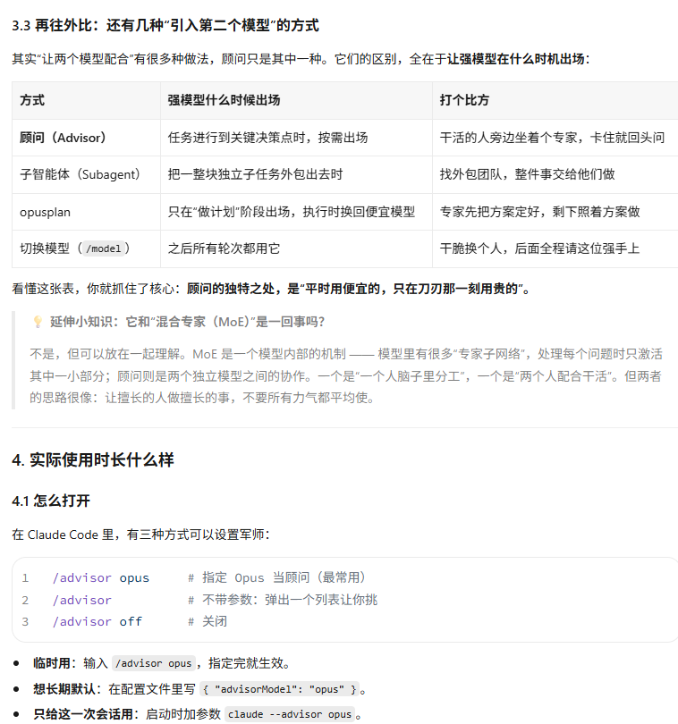
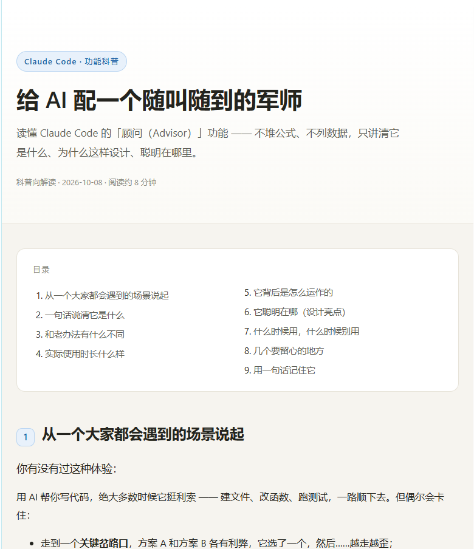

# research-to-teaching-doc

> 把一个陌生的名词、一个主题，或一份现成材料，转化为**面向大众的科普 / 教学向文档** —— 可选同时产出一份**带插图的自包含 HTML 网页**。

一个遵循 **SKILL.md** 约定的通用 Agent Skill，把「**给个概念 / 给份材料 → 写成通俗易懂的科普稿 →（可选）做成可分享的网页**」这条流程固化下来，让每次产出都保持一致的风格与质量。

**不绑定任何特定 Agent**：任何支持该约定的 agent 都可以直接加载使用。

---

## 效果预览

**输入** —— 只丢一个名词、一句调研任务，或一份现成的技术材料（报告 / 论文 / 内部文档 / 笔记）：

```
帮我调研 Claude Code 的 /advisor 功能
```

**输出** —— 一篇通俗的科普文档；**明确要求时**，再额外产出一份带插图的自包含网页：

<table>
  <tr>
    <td width="50%" valign="top">
      
    </td>
    <td width="50%" valign="top">
      
    </td>
  </tr>
  <tr>
    <td align="center"><sub>① 文档版 · Markdown 成品</sub></td>
    <td align="center"><sub>② 网页版 · 单文件 HTML，离线可开</sub></td>
  </tr>
</table>

---

## 背景：概念跑得比人快

AI 时代的常态是——**概念涌现的速度，超过任何人消化的速度**。今天一个新缩写，明天一个新范式：Agent、MCP、RAG、上下文工程、模型路由、advisor……每一个都值得了解，但没有谁有精力把官方文档、论文和评测报告逐个读完。

于是大多数人卡在两端之间：

| 一端 | 另一端 |
| --- | --- |
| **只知道一个名字** —— 听说过，但说不清它解决什么问题、什么时候该用、坑在哪。讨论时只能跟着复读名词，也判断不了该不该上 | **事无巨细地了解** —— 把文档、源码、benchmark 啃完，理解确实扎实，但时间成本高到不可能对每个概念都来一遍 |

真正需要的是**中间那一层**：花十几分钟，把"它是什么、解决什么问题、怎么运作、和熟悉的东西有什么不同、什么时候别用"弄明白——**够用、准确、能拿去判断和沟通**。既不是只知道一个名字，也不必把它研究到底。

## 这个 skill 做什么

这件事很适合交给 agent：**你只要丢给它一个名词，或者一份现成的材料**（报告 / 论文 / 内部文档 / 笔记），它就能替你产出这份"中间层"内容——一份通俗文档，需要时再加一份带插图的网页。

难点在于"通俗"很容易走偏：要么照抄术语，读了等于没读；要么简化到失真，一用就错。所以这里把流程固化下来，让每次产出的质量稳定：

- 先**核实**事实再动笔——通俗 ≠ 可以编
- 用一个**贯穿全文的比喻**（如"主角与军师"）把抽象概念讲活
- 主动**串联相似概念**（架构、功能、误区辨析），而不是孤立地讲一个名词
- 明确交代**边界与局限**——适合谁、什么时候别用、有什么坑
- **不堆** benchmark 数字表、公式推导、参考文献列表

这也决定了它的定位：**它不是技术调研报告的替代品**。那类材料术语密、数据多、论证长，写给评审与存档，目标是"让人信服"；而这里的读者是**想快速搞懂的普通人**，目标是"让人理解"。

## 适用场景

✅ 适合

- 调研某主题并写成**科普 / 教学向**文档
- 把已有技术材料（报告、论文、内部文档、笔记）**降维改写成通俗版**
- 要求"小白也能懂""面向大众""帮读者快速理解"

❌ 不适合

- 需要严谨引用、数据论证、可送审的**技术调研报告 / 学术稿**（那走普通报告流程）

触发词：调研并写成科普、教学稿、科普教学向、通俗易懂、给大众看、小白也能懂、把这份报告改成科普版、写篇科普。

---

## 安装

本 skill 遵循通用的 `SKILL.md` 约定，安装方式就是**把它放进你所使用 agent 的 skills 目录**（目录名保持 `research-to-teaching-doc`）：

```bash
git clone https://github.com/Starnever0/research-to-teaching-doc.git <你的-skills-目录>/research-to-teaching-doc
```

常见 agent 的 skills 目录示例：

| Agent | 用户级目录 |
| --- | --- |
| Claude Code / Anthropic Agent Skills | `~/.claude/skills/` |
| WorkBuddy | `~/.workbuddy/skills/` |
| 其他 | 你所使用 agent 对应的 skills 目录 |

若你的 agent 不使用 skills 目录，也可以直接把 `SKILL.md` 作为系统提示 / 上下文的一部分交给它。

## 使用

直接用自然语言触发即可：

```
调研 Claude Code 的 /advisor 功能，写成一篇科普稿
```

需要网页版时，**明确说一句**：

```
…再配一版网页
…做成可分享的 HTML
--web
```

### 参数

| 参数 | 默认 | 说明 |
| --- | --- | --- |
| （无） | ✅ | **只产出 Markdown 文档** |
| `--web` / "再配一版网页" | ❌ | 额外产出一份自包含 HTML 网页 |

> 设计取向：**默认不生成网页**，避免不必要的产出。未明确要求时，skill 只会询问一句，而不会直接生成。

---

## 产出示例

`assets/sample/` 里放了完整的参考成品（主题：Claude Code 顾问功能）：

| 文件 | 说明 |
| --- | --- |
| [`sample-teaching-doc.md`](assets/sample/sample-teaching-doc.md) | **文档版**成品 —— 看它的章节骨架、比喻手法与排版 |
| [`sample-teaching-page.html`](assets/sample/sample-teaching-page.html) | **网页版**成品 —— 看它的插图与版式（单文件、离线可开） |

---

## 目录结构

```
research-to-teaching-doc/
├── SKILL.md                    # 主流程：目标 / 适用 / 输入输出 / 原则 / 步骤 / 参数 / 注意事项
├── references/
│   ├── writing-style.md        # 写作规范：语气、比喻手法、圈层对比法、交付前自检清单
│   └── html-page-spec.md       # 网页规范：设计令牌、组件表、SVG 插图要求、验收清单
└── assets/
    ├── page-template.html      # 可复用网页骨架（含占位符，改内容不动样式）
    ├── sample/                 # 参考样例（文档 + 网页）
    └── screenshots/            # README 预览图
```

## 标准章节骨架

1. 场景开场 —— 一个大家都会遇到的困扰
2. 一句话说清它是什么 —— 核心比喻 + 角色对照
3. 和熟悉的东西有什么不同 —— 串联相似概念，逐层对比
4. 实际使用 / 表现
5. 背后是怎么运作的 —— 用"发生了什么"讲原理
6. 它聪明在哪 —— 提炼设计亮点
7. 什么时候用 / 别用
8. 要留心的地方 —— 局限与边界
9. 用一句话记住它 —— 收尾金句
10.（可选）延伸小知识 —— 一个概念辨析

---

## 说明

- 网页版**完全自包含**：CSS 与插图（SVG）全部内联，无任何外部依赖，离线双击可打开、可直接分享。
- 科普 ≠ 可以编。产品名、日期、版本、能力边界仍需核实，不确定处会明确标注。
- 具体功能与事实请以官方最新资料为准。

